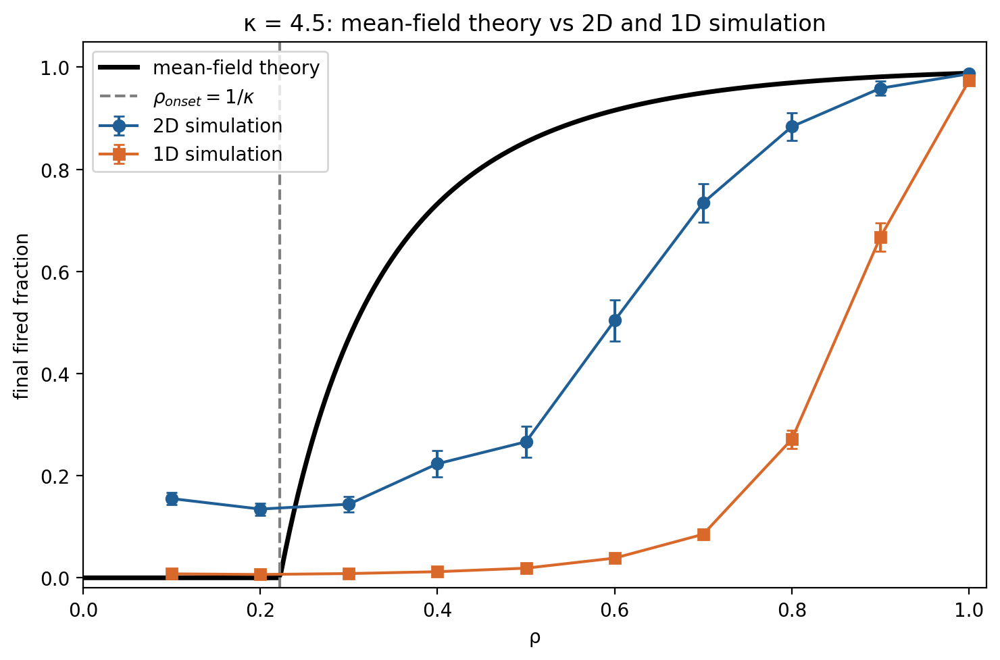

[README.md](https://github.com/user-attachments/files/33177796/README.md)
# Mousetrap chain reactions: mean-field theory vs lattice simulation

An introductory complex-systems modelling project. A chain reaction of mousetraps and ping-pong balls is simulated on a 1D and a 2D lattice and compared with a mean-field branching-process theory. The question: above which trap density does the reaction become macroscopic, and what fraction of traps does it fire?

## The problem

This project answers an International Physicists' Tournament (IPT) problem from 2021:

> An array of mousetraps and ping-pong balls results in a chain reaction. Construct a model for the macroscopic dynamics of such a system, identifying all relevant parameters, and determine the spatiotemporal behavior of the mousetrap excitation probability, and the threshold mousetrap density for the chain reaction to occur.

How the project maps onto the three requirements:

| Requirement | Where it is addressed |
|---|---|
| A model of the macroscopic dynamics, with all relevant parameters | The lattice model and the branching-process theory below. The parameters are the trap density ρ, the number of attempts per fired trap `m`, the short/long-range mix `p_long`, the success probabilities `p_succ_short` and `p_succ_long(k)`, and the distance distribution `f_k`. They combine into one number, κ. |
| The spatiotemporal behaviour of the excitation probability | The simulations record the state of every cell at every generation (Notebooks 0 and 1), and the mean-field iteration gives the density of newly activated traps per generation (Notebooks 3 and 4, sections 3.3 and 4.3). No closed-form space-time solution is derived. |
| The threshold density for the chain reaction | ρ_onset = 1/κ, tested against simulation at the default parameters and in a supercritical setting (see Results). |

*Mean-field prediction (black) against simulation in 2D (blue, L = 100) and 1D (orange, L = 2000), for κ = 4.5. Points are means with standard errors.*

## Model

Traps sit on a lattice, each cell occupied with probability ρ. One random trap is fired. Every fired trap makes `m` independent attempts per generation, and each attempt is either:

- **short-range** (probability `1 - p_long`): a nearest-neighbour hop, success probability `p_succ_short`;
- **long-range** (probability `p_long`): a distance `k ≥ 2` is drawn from `f_k`, one site at that distance is chosen at random (2 sites in 1D, a Chebyshev ring in 2D), and it fires with probability `p_succ_long(k)`.

A fired trap becomes spent after one generation. Cells are inert, armed, firing or spent.

## Theory

- **Branching number** κ: the mean number of successful attempts per fired trap. The simulator picks one branch per attempt, so
  κ = m [ (1 − p_long) q_s + p_long q_ℓ ], with q_s = `p_succ_short` and q_ℓ = E[`p_succ_long(k)`].
- **Onset density:** a cascade can only grow if ρκ > 1, so ρ_onset = 1/κ.
- **Final size:** the final fired fraction F solves F = 1 − exp(−ρκF), which has a non-trivial root only for ρκ > 1. The equation comes from a Poisson argument: each site receives a Poisson number of attempts with mean κρF.

## Tests

Three comparisons between theory and simulation, in both geometries:

1. **κ itself:** traps fired in generation 1 against ρκ (z-scores and a fitted slope).
2. **Final fired fraction** against F(ρ) (standard errors, RMSE, several lattice sizes).
3. **Onset density:** where P(fired fraction > threshold) crosses 50%, for several thresholds and sizes.

## Results

**Default parameters (`m = 1`, `p_long = 0.5`): κ = 0.497, onset at ρ = 2.01.** Every density is subcritical, and theory and simulation agree.

- κ matches: 2D fitted 0.492, 1D fitted 0.493 (|z| ≤ 1.59 and ≤ 0.45).
- Both predict essentially no macroscopic cascade. The simulated fired fraction falls as the lattice grows (2D RMSE 0.0017 at L = 50 and 0.0004 at L = 100).

**Supercritical test (`m = 5`, `p_long = 1`, `p_succ_long = 0.9`): κ = 4.5, onset at ρ = 0.222.** This is the part that tests the theory.

| | 2D (L = 50, 100) | 1D (L = 1000, 2000) |
|---|---|---|
| Fitted κ (theory 4.5) | 4.43 | 3.87 |
| Final fraction vs theory | within 0.01 for ρ ≥ 0.7; theory too high near the onset | 0.02 vs 0.85 at ρ = 0.5; falls as L grows |
| RMSE | 0.13 | 0.56 – 0.59 |
| Onset offset from 1/κ | +0.10, stable | +0.35 to +0.51, grows with L |

- **κ counts attempts, not new traps.** The simulator merges several hits on the same trap within a generation. In 1D a hop at distance `k` has only two target sites, so the five attempts often coincide: the expected number of distinct targets is 3.85, matching the 1D fit.
- **The final-size theory works in 2D and fails in 1D.** Mean-field assumes every attempt lands on a uniformly random site.
- **Hypothesis (not tested directly):** attempts are local (mean distance ≈ 4.3 sites), so the cascade travels as a front and the sites within reach behind it are already spent. In 1D one of a trap's two nearest neighbours is always the trap that fired it, so the effect is much stronger.

## Limits

- One supercritical parameter set was tested.
- 2D uses 50 runs per density, 1D uses 100; near the onset the error bars are large.
- The 1D fired fraction has not converged with lattice size at ρ ≤ 0.9, so whether a macroscopic transition exists there is open.
- The effective κ (3.85 in 1D) has been measured but not put into the prediction.

## Next steps

1. Test the locality hypothesis: draw `k` from a distribution uniform over the whole lattice and check whether the mean-field curve returns.
2. Repeat with other values of `m` and other kernels.
3. Use the effective κ in the final-size equation and plot how much of the gap it explains.

## Files

| File | Content |
|---|---|
| `Notebook 0` | Building the 2D model step by step |
| `Notebook 1` | The 1D model, and why the default parameters die out |
| `Notebook 2` | Background theory (R₀, ρ_c, reaction-diffusion) |
| `Notebook 3` | 2D theory and comparison, including the supercritical test (3.9–3.10) |
| `Notebook 4` | 1D theory and comparison, including the supercritical test (4.9–4.10) |
| `Functions_final.py` | Final 2D simulator used by Notebook 3 |
| `Functions_for_Notebook_0.py`, `Functions_for_Notebook_1.py` | Earlier 2D functions and the 1D simulator |

## Running it

Python 3 with `numpy`, `scipy`, `matplotlib` and `jupyter`. Keep the function files in the same folder as the notebooks, and run each notebook top to bottom. Sections 3.9 and 4.9 overwrite the model parameters, so they must run last. Notebook 3's supercritical section takes a few minutes.

## Use of AI assistance

*(Edit this paragraph to match what you did.)* I designed the problem and the tests and interpreted the results. Claude was used to help write code, notebook text and plots; I checked the results and can explain each part.

## Reference

The theory follows the accompanying note `one_dimensional_mouse_trap_model.pdf`.
